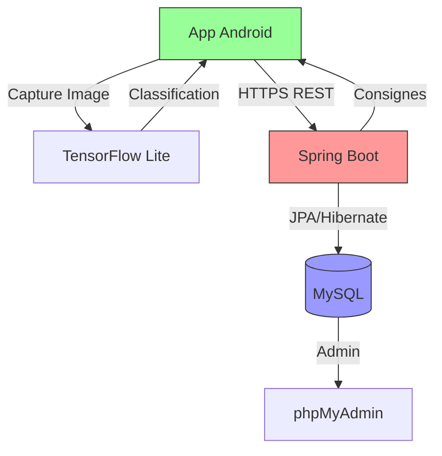

# ♻️ SmartRecycle
<sub>Application mobile de tri intelligent par IA</sub>

## Description
Solution de classification des déchets en temps réel via un modèle TensorFlow Lite embarqué, fonctionnant hors ligne. L'application s'intègre avec un backend Spring Boot pour fournir des consignes de tri adaptées aux réglementations locales.

## Fonctionnalités principales
- **Classification visuelle** des déchets sans connexion Internet
- **Base de données** des règles locales de recyclage (MySQL)
- **API sécurisée** en HTTPS pour les mises à jour
- **Léger et rapide** (optimisé pour mobile)

## 🏗 Architecture



### Composants
1. **Couche Mobile** :
   - Module IA embarqué (TFLite)
   - Appels API sécurisés
2. **Couche Backend** :
   - Contrôleurs Spring Boot
   - Service de règles métier
   - Repository JPA
3. **Couche Données** :
   - Tables MySQL : 
     - `consigne_tri`
     

## Stack technique

### Application mobile (Android)
- Java/Kotlin
- Android SDK 35 (compile) / 24+ (minimum)
- TensorFlow Lite 2.12.0
- CameraX 1.2.3
- Retrofit 2.9.0

### Backend
- Spring Boot 3.4.0
- Spring Security
- Spring Data JPA
- MySQL
- Java 22
- Maven 3.8.1+
- H2 Database (pour tests)

### Outils
- Postman (tests API)
- Git/GitHub (gestion de version)
- phpMyAdmin (administration MySQL)

## 🔧 Installation

1. Cloner le dépôt :
```bash
git clone https://github.com/Nssaiba/Android-SmartRecycle.git
cd SmartRecycle
```

2. Configurer l'environnement de développement :
```bash
# Installation des dépendances backend
cd backend
./mvnw clean install

# Configuration de la base de données
cp src/main/resources/application.properties.example src/main/resources/application.properties
# Modifier les informations de connexion à la base de données
```

3. Lancer l'application backend 

4. Configurer et lancer l'application Android :
   - Ouvrir le dossier `android/` dans Android Studio
   - Synchroniser le projet avec Gradle
   - Exécuter l'application sur un émulateur ou un appareil physique

## 📦 Dépendances

### Backend (Spring Boot)
```gradle
dependencies {
    implementation 'org.springframework.boot:spring-boot-starter-data-jpa'
    implementation 'org.springframework.boot:spring-boot-starter-security'
    implementation 'org.springframework.boot:spring-boot-starter-web'
    developmentOnly 'org.springframework.boot:spring-boot-devtools'
    runtimeOnly 'com.h2database:h2'
    runtimeOnly 'com.mysql:mysql-connector-j'
    testImplementation 'org.springframework.boot:spring-boot-starter-test'
    testImplementation 'org.springframework.security:spring-security-test'
    testRuntimeOnly 'org.junit.platform:junit-platform-launcher'
}
```

### Frontend Android
```gradle
dependencies {
    // Core Android libraries
    implementation(libs.androidx.core.ktx)
    implementation(libs.androidx.appcompat)
    implementation(libs.material)
    implementation(libs.androidx.activity)
    implementation(libs.androidx.constraintlayout)

    // Room
    implementation(libs.androidx.room.external.antlr)

    // TensorFlow Lite - using specific implementation to avoid conflicts
    implementation("org.tensorflow:tensorflow-lite:2.12.0") {
        exclude(group = "org.tensorflow", module = "tensorflow-lite-api")
    }
    implementation("org.tensorflow:tensorflow-lite-gpu:2.12.0") {
        exclude(group = "org.tensorflow", module = "tensorflow-lite-api")
    }

    // Google LiteRT - keep these but make sure they don't overlap with TensorFlow
    implementation(libs.litert.support.api)

    // Retrofit for backend communication
    implementation("com.squareup.retrofit2:retrofit:2.9.0")
    implementation("com.squareup.retrofit2:converter-gson:2.9.0")
    implementation("com.squareup.okhttp3:logging-interceptor:4.9.0")

    // CameraX for real-time capture
    implementation("androidx.camera:camera-camera2:1.2.3")
    implementation("androidx.camera:camera-lifecycle:1.2.3")
    implementation("androidx.camera:camera-view:1.2.3")

    // Tests
    testImplementation(libs.junit)
    androidTestImplementation(libs.androidx.junit)
    androidTestImplementation(libs.androidx.espresso.core)
}
```
## 📱 Captures d'écran

<details>
  <summary> <b>Voir les interfaces</b> (cliquer pour déplier)</summary>

  ### Figure 1 : Accueil  
    
  *Écran principal présentant :*  
  - 📸 Bouton de **capture photo** pour l'analyse  
  - ♻️ Accès rapide aux **consignes de tri** par catégorie 

  ---

  ### Figure 2 : Résultat d'analyse  
    
  *Fonctionnalités clés :*  
  -  **Prédiction IA** (ex: "glass,plastic,cardboard...")  
  -  **Instructions a partir de la base de données** de recyclage 

  ---

  ### Figure 3 : Gestion des consignes *(Admin)*  
    
  *Pour administrateurs :*  
  -  Modification des **règles municipales**  
  -  Listage des **consignes de tri**    
  - Synchronisation avec le backend  

  ---

  ### Figure 4 : Ajout de règle  
    
  *Formulaire avec :*  
  -  Définition de **nouveaux matériaux**  
  -  Paramétrage des **modalités de tri** 
</details>

## Simulation

https://github.com/user-attachments/assets/2757b9b5-43d2-4944-92be-b05254c3de26

