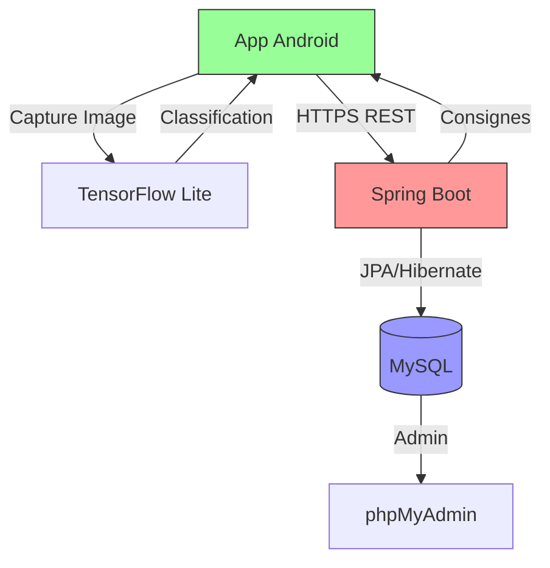

# ♻️ SmartRecycle
<sub>Application mobile de tri intelligent par IA</sub>

## 📋 Description
Solution de classification des déchets en temps réel via un modèle TensorFlow Lite embarqué, fonctionnant hors ligne. L'application s'intègre avec un backend Spring Boot pour fournir des consignes de tri adaptées aux réglementations locales.

## ✨ Fonctionnalités principales
- **Classification visuelle** des déchets sans connexion Internet
- **Base de données** des règles locales de recyclage (MySQL)
- **API sécurisée** en HTTPS pour les mises à jour
- **Léger et rapide** (optimisé pour mobile)

## 🏗 Architecture



### Composants :
1. **Couche Mobile** :
   - Module IA embarqué (TFLite)
   - Appels API sécurisés
2. **Couche Backend** :
   - Contrôleurs Spring Boot
   - Service de règles métier
   - Repository JPA
3. **Data Layer** :
   - Tables MySQL : 
     - `recycling_rules`
     - `material_categories`

## 🛠 Stack technique

### Application mobile
- Android (Kotlin/Java)
- TensorFlow Lite (modèle embarqué)

### Backend
- Spring Boot (Java)
- MySQL (phpMyAdmin en option)

### Outils
- Postman (tests API)
- Git/GitHub (gestion de version)

## 🔧 Installation
1. Cloner le dépôt :
```bash
git clone https://github.com/votreuser/SmartRecycle.git
cd SmartRecycle
```

2. Configurer l'environnement de développement :
```bash
# Installation des dépendances backend
cd backend
./mvnw clean install

# Configuration de la base de données
cp src/main/resources/application.properties.example src/main/resources/application.properties
# Modifier les informations de connexion à la base de données
```

3. Lancer l'application backend :
```bash
./mvnw spring-boot:run
```

4. Configurer et lancer l'application Android :
   - Ouvrir le dossier `android/` dans Android Studio
   - Synchroniser le projet avec Gradle
   - Exécuter l'application sur un émulateur ou un appareil physique

## 📱 Captures d'écran


## 🤝 Contribuer
Les contributions sont les bienvenues ! N'hésitez pas à ouvrir une issue ou à proposer une pull request.

## 📄 Licence
Ce projet est sous licence MIT - voir le fichier [LICENSE](LICENSE) pour plus de détails.

https://github.com/user-attachments/assets/2757b9b5-43d2-4944-92be-b05254c3de26

